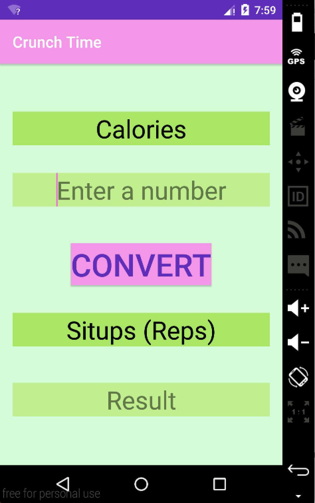
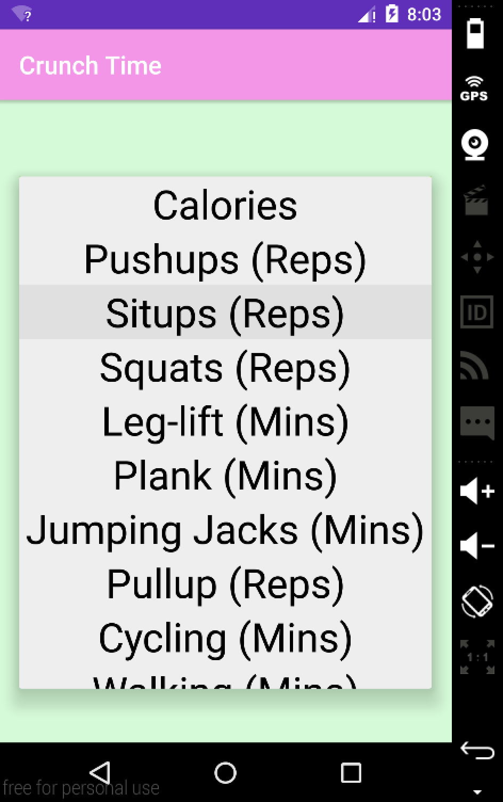
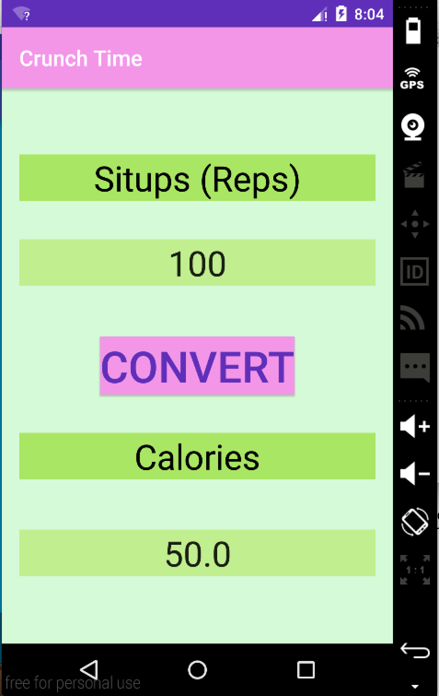
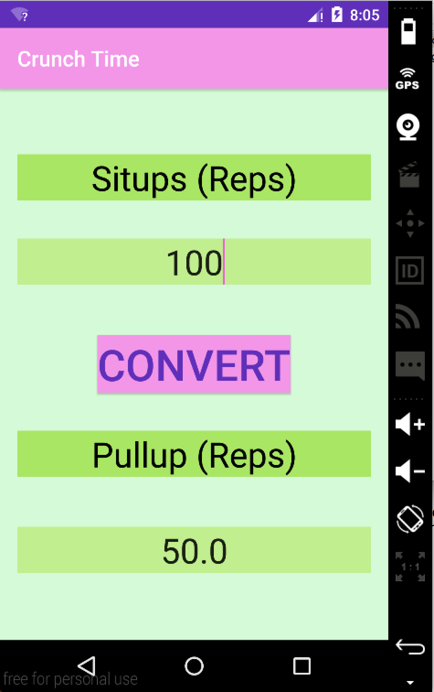
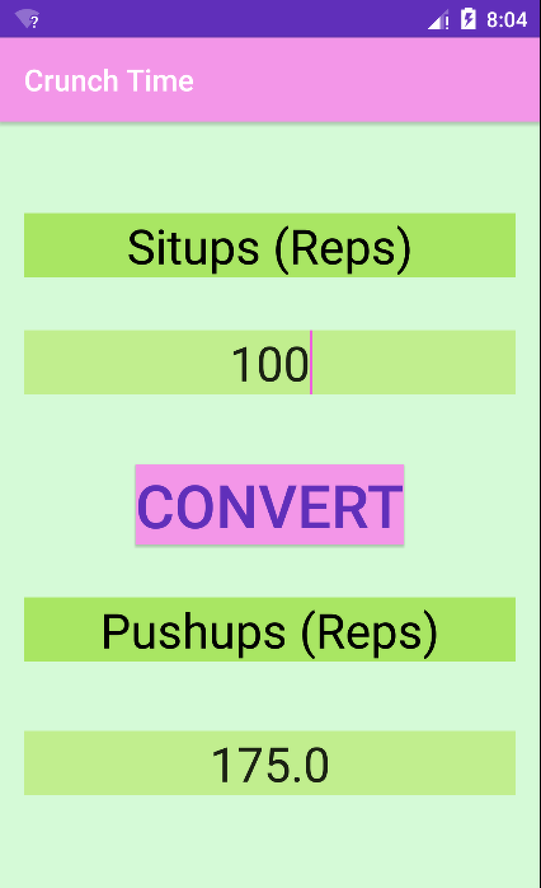

# PROG 01: Crunch Time

This Android application aims at calorie burning conversion. When given an input of the type and the amount of exercise, the application is able to calculate how many calories that users burnt. Furthermore, the application is also capable of converting between different types of exercises. When the user selects the type and the amount of exercise to be converted from, and the type of exercise to be converted into, the application will output the amount of the latter exercise that is equivalent to the that of the former. 
The interaction is quite simple. To start, the user first select the type of first exercise from the top spinner, in which calorie is also an option. Second, the user specifies the amount of exercise by entering a number below the spinner. Notice that the units are provided in the spinner. Third, the user picks the type of the second exercise from the second spinner. Finally, the user clicks on the convert button, and the app will display the conversion in the result field. To see graphic representation, go to the next section. 

## Authors

Cady Xu ([cxu@berkeley.edu](mailto:cxu@berkeley.edu))

## Demo Video

See [Crunch Time: A Calorie Converter ] (https://youtu.be/Gspng5RYm8I)

## Screenshots

## Acknowledgments
None. 